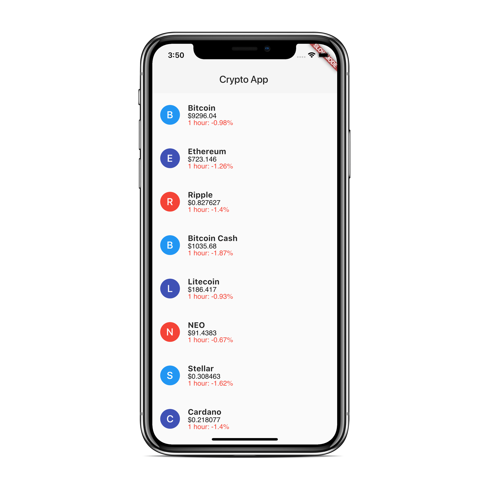
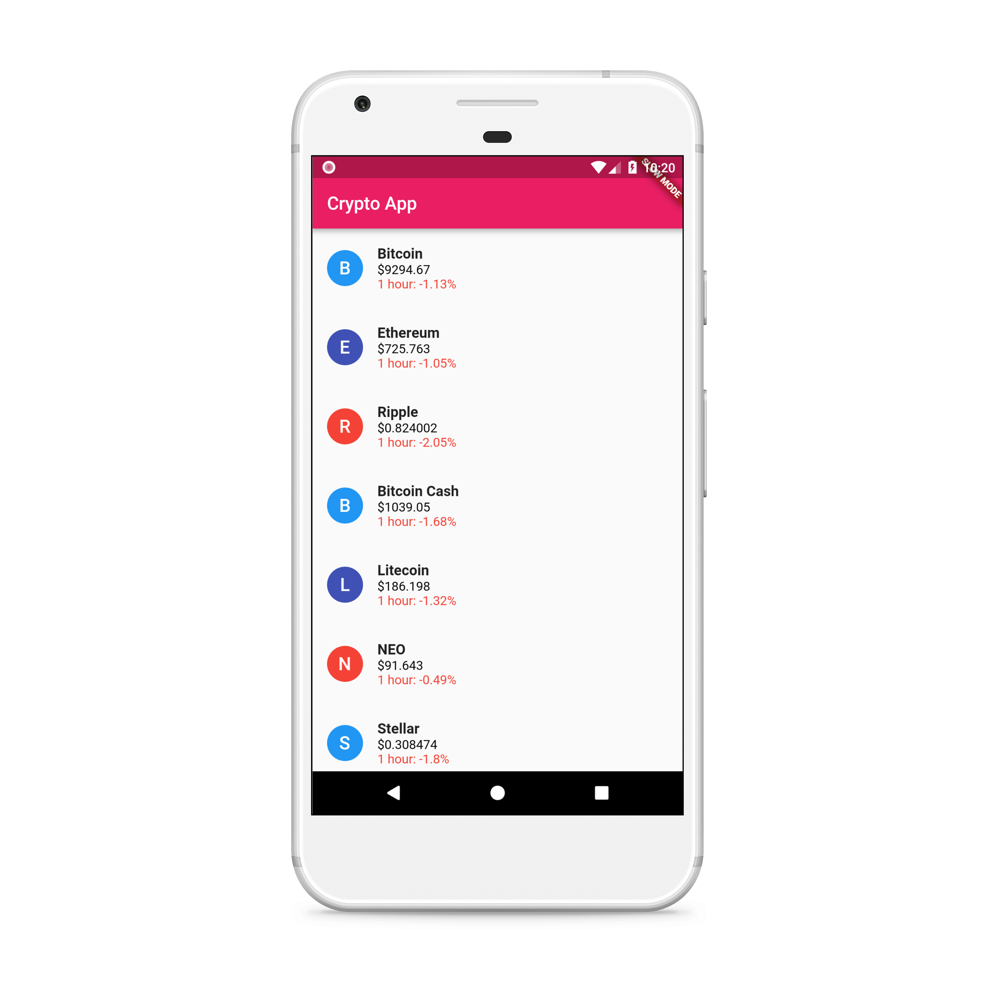

# Flutter CryptoCurrency App (MVP)

Cryptocurrency App with MVP design pattern to track all the coins data in realtime for android & iOS . Written in dart using Flutter SDK.
Please don't forget to give stars so that i keep updating the project. Thanks

[Watch the non-mvp video tutorial on Youtube](https://youtu.be/cPlaYS4eqe4)
[Watch the mvp video tutorial on Youtube](https://youtu.be/I2AgSDAEZSE)
## Getting Started

For help getting started with Flutter, view our online
[documentation](https://flutter.io/).
